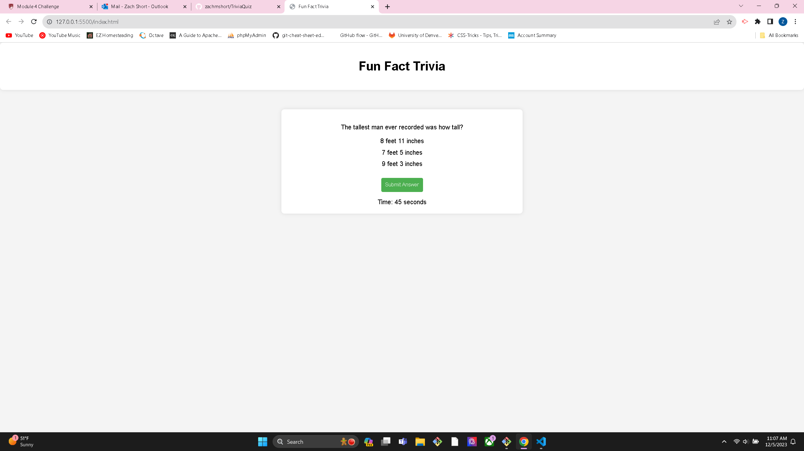

# TriviaQuiz

This is the fourth challenge in the DU Coding Bootcamp. Being an even number challenge, all of the code was written from scratch, I utilized W3 schools a lot on the project. I tried to hit as many of the MVP requirements as possible but external circumstances made it difficult for me to complete the project.

Link to site: https://github.com/zachmshort/TriviaQuiz/

Link to repo: https://github.com/zachmshort/TriviaQuiz
